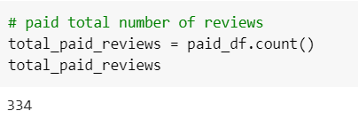
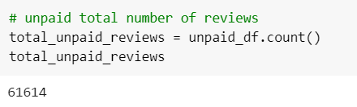
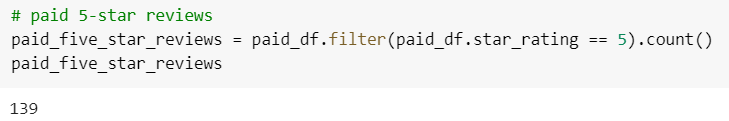
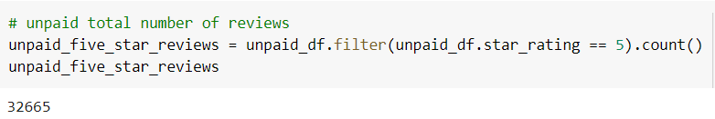
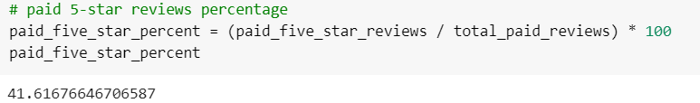
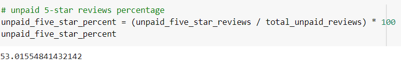

# Amazon_Vine_Analysis

## Overview of the analysis: Explain the purpose of this analysis.
The aim of the analysis is to determine if there is any bias toward favorable reviews from Vine members in the dataset selected. There are aproximately 50 datasets which each one contains reviews of a specific product, in this project, the sports dataset is going to be selected.

## Results: Using bulleted lists and images of DataFrames as support, address the following questions:

### Total Vine Reviews

### Total non-Vine Reviews

### Total 5-stars Vine reviews

### Total 5-stars non-Vine reviews

### Percent of 5-stars Vine reviews 

### Percent of 5-stars non-Vine reviews

## Summary: 

In your summary, state if there is any positivity bias for reviews in the Vine program. Use the results of your analysis to support your statement. Then, provide one additional analysis that you could do with the dataset to support your statement.
